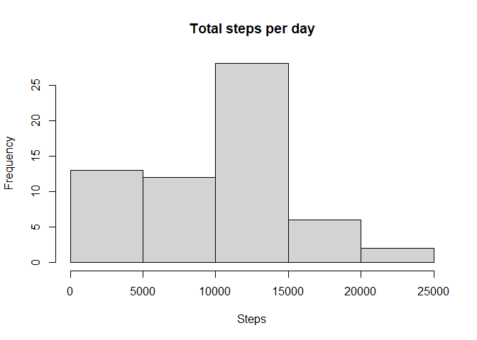
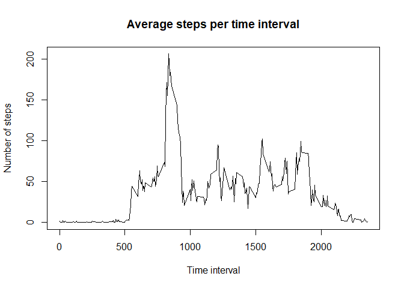
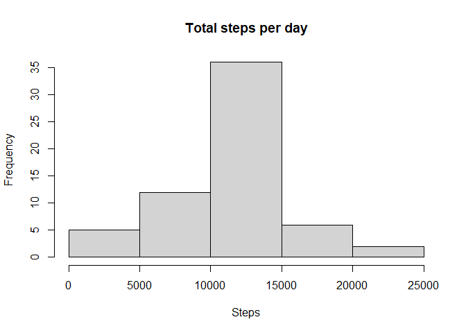

## Loading and preprocessing the data

The file is read with 'read.csv'. Looking at the resulting dataframe, all seems good and no pre-processing is needed for the moment.


```r
activity <- read.csv("activity.csv")
```

## What is mean total number of steps taken per day?

First, the dataframe is grouped by the date with the function aggregate (summing the steps and removing NA values). Then new labels for the variables are provided for cleanliness.
The histogram of the number of total steps per day is generated, showing that the most common number of total steps per day lays between 10k and 15k steps.
Finally, the mean and the median are calculated on the column with the total steps per day.


```r
activity_daily <- aggregate(activity$steps, by = list(activity$date), FUN = sum, na.rm = TRUE)
names(activity_daily) <- c("day", "total_steps")
hist(activity_daily$total_steps, main = "Total steps per day", xlab = "Steps")
```

<!-- -->

```r
steps_mean <- mean(activity_daily$total_steps)
steps_median <- median(activity_daily$total_steps)
print(paste("The mean is", as.integer(steps_mean), "steps"))
```

```
## [1] "The mean is 9354 steps"
```

```r
print(paste("The median is", as.integer(steps_median), "steps"))
```

```
## [1] "The median is 10395 steps"
```

## What is the average daily activity pattern?

This time, the dataframe is grouped by the interval.
Again, new labels are created for cleanliness and the line plot is printed, showing a definite peak in the morning.
The time interval at which this peak happens is finally calculated with the which function.


```r
activity_int <- aggregate(activity$steps, by = list(activity$interval), FUN = mean, na.rm = TRUE)
names(activity_int) <- c("Interval", "Steps")
plot(activity_int$Interval, activity_int$Steps, type = "l", main = "Average steps per time interval", xlab = "Time interval", ylab = "Number of steps")
```

<!-- -->

```r
max_int <- activity_int$Interval[which(activity_int$Steps == max(activity_int$Steps))]
print(paste("The maximum interval is at", as.integer(max_int)))
```

```
## [1] "The maximum interval is at 835"
```

## Imputing missing values

First, the number of missing values is calculated.
Then the strategy to fill them is to use the average number of steps across all days (using the dataframe activity_int previously calculated). A for loop is used for this.
For the new matrix, the same calculations done above are repeated.


```r
num_na <- sum(is.na(activity$steps))
print(paste("The number of missing values is", as.integer(num_na)))
```

```
## [1] "The number of missing values is 2304"
```

```r
activity_full <- activity
for (i in 1:dim(activity)[1]) {
  if (is.na(activity$steps[i]) & i%%288 != 0) {
    activity_full$steps[i] <- activity_int[i%%288,2]
  }
  if (is.na(activity$steps[i]) & i%%288 == 0) {
    activity_full$steps[i] <- activity_int[288,2]
  }
}
activity_daily <- aggregate(activity_full$steps, by = list(activity_full$date), FUN = sum, na.rm = TRUE)
names(activity_daily) <- c("day", "total_steps")
hist(activity_daily$total_steps, main = "Total steps per day", xlab = "Steps")
```

<!-- -->

```r
steps_mean <- mean(activity_daily$total_steps)
steps_median <- median(activity_daily$total_steps)
print(paste("The new mean is", as.integer(steps_mean), "steps"))
```

```
## [1] "The new mean is 10766 steps"
```

```r
print(paste("The new median is", as.integer(steps_median), "steps"))
```

```
## [1] "The new median is 10766 steps"
```

All the nubers have clearly increased, as before the NA values were just omitted. In particular, in the histogram, the frequency of days with steps between 10k and 15k has significantly increased.

## Are there differences in activity patterns between weekdays and weekends?

First, the Date column is converted to a Date class and the new factor variable is created. Then the data is grouped by the new factor variable and the interval calculating the average;
Finally the plot is created using lattice.


```r
activity_full$date <- as.Date(activity_full$date)
activity_full$week <- weekdays(activity_full$date)
activity_full$week <- factor(ifelse(activity_full$week %in% c('Sunday', 'Saturday'), 'Weekend', 'Weekday'))
activity_full_int <- aggregate(activity_full$steps, by = list(activity_full$week, activity_full$interval), FUN = mean, na.rm = TRUE)
names(activity_full_int) <- c("Day", "Interval", "Steps")
library(lattice)
xyplot(Steps ~ Interval | Day, data = activity_full_int, layout = c(1,2), type = "l")
```

<!-- -->

There is a clear difference between weekdays and weekends. For example, we can notice how the peak at 8.35 is characteristic only of the weekdays, which is likely due to to the walk to go to work.
